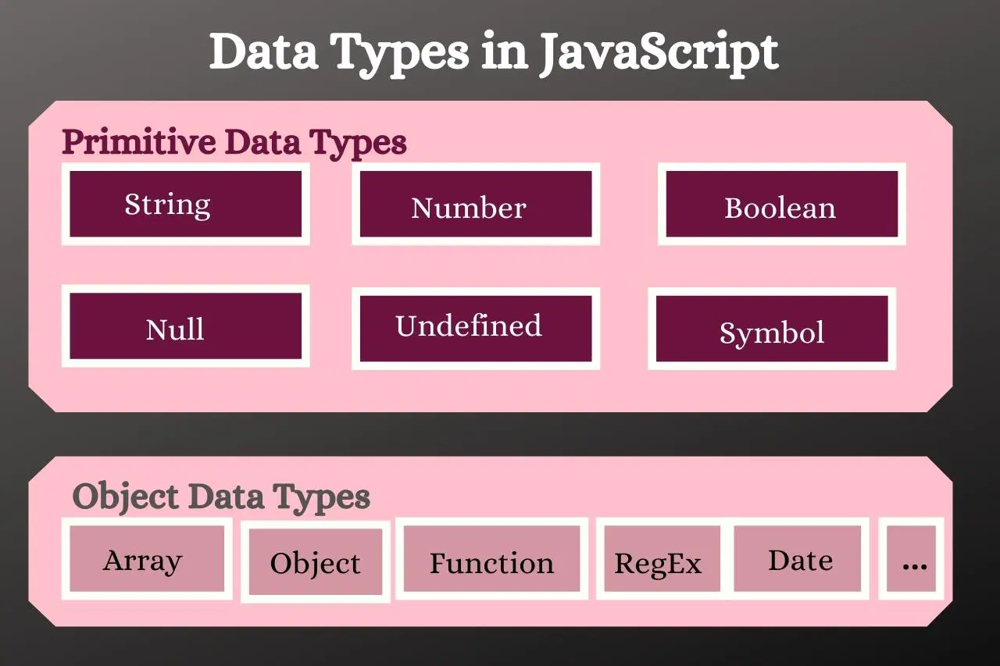

# Lesson 2: Operators and data types

## Contents
1. [Arithmetic Operators](#1-arithmetic-operators)
2. [Assignment Operators](#2-assignment-operators)
3. [Comparison Operators](#3-comparison-operators)
4. [String Operators](#4-string-operators)
5. [If-else Condition](#5-if-else-condition)
6. [Logical Operators](#6-logical-operators--boolean-operators)
7. [Type Operators](#7-type-operators)
8. [Bitwise Operators](#8-bitwise-operators)
9. [Variables](#9-variables)
10. [Truthy and Falsy](#10-truthy-and-falsy)

-----
## 1. Arithmetic Operators
| Operators  |   Syntax   |
|------------|------------|
| Addition | + |
| Substraction | - |
| Multiplication | * |
| Exponentiaion | ** |
| Division | / |
| Modulus (Division Remainder) | % |
| Increment | ++ |
| Decrement | -- |
```javascript
     // Declare variables
     var a = 5, b = 2;
     
     // Addition
     console.log(a + b); // 7

     // Substraction
     console.log(a - b); // 3

     // Multiplication
     console.log(a * b); // 10

     // Exponentiation
     console.log(a ** b); // 25

     // Division
     console.log(a / b); // 2.5

     // Modulus 
     console.log(a % b); // 1

     /**
      * Notice about the logic of increment (++) and decrement (--) (Prefix & Postfix)
      */
     // Increment
     console.log(a++); // 5 (print 5 then add 1 becomes 6)
     console.log(++a); // 7 (add 1 becomes 7 then print 7)

     // Decrement
     console.log(b--); // 2 (print 2 then minus 1 becomes 1)
     console.log(--b); // 0 (minus 1 becomes 0 then print 0)
```

## 2. Assignment Operators
|  Operators  |   Example  |   Same as  |
|-------------|------------|------------|
| = | x = y | x = y |
| += | x += y | x = x + y |
| -= | x -= y | x = x - y |
| **= | x **= y | x = x ** y |
| /= | x /= y | x = x / y |
| %= | x %= y | x = x % y |
| *= | x *= y | x = x * y |
```javascript
     // Declare variables
     var a = 5;

     a += 1; // 6

     a -= 2; // 4

     a **= 2 // 16

     a /= 4 // 4

     a %= 3 // 1

     a *= 2 // 2
```

## 3. Comparison Operators
- The operator will compare to variables and return **TRUE** or **FALSE** as a boolean

|  Operators  |   Description  |
|-------------|----------------|
| == | equal to |
| === | equal value and type |
| != | not equal to |
| !== | not equal value or not equal type |
| > | greater than |
| < | less than |
| >= | greater than or equal to |
| <= | less than or equal to |
| ? | ternary operator |

```javascript
     // Declare variables
     var a = 1;
     var b = 2;
     var c = "1";
     var d = -1;

     // Comparison
     var i = (a > b);
     console.log(i) // false

     var j = (a == c);
     console.log(j); // true

     var k = (a === c);
     console.log(k); // false

     var t = (a <= d);
     console.log(t); // false
```

## 4. String Operators
1. Addition: combine strings
```javascript
     // Declare variables
     var first_name = "Gia Phuc";
     var last_name = "Pham";

     console.log(first_name + last_name); // Gia PhucPham
     console.log(first_name + " " + last_name); // Gia Phuc Pham

     OR:

     // Declare variables
     var a = "Hello";
     a = a + " World";
     console.log(a); // Hello World
```
2. Comparison: compare strings **alphabetically**
```javascript
     // Declare variables
     var letter_a = "A";
     var letter_b = "B";
     console.log(a > b); // true (Because in the alphabet, B is after A.)

     // Declare variables
     var num1 = "20";
     var num2 = "5";
     console.log(num1 > num2); // false (Because in number, 5 is larger than 2.)
```

## 5. If-else Condition
- Syntax:
```javascript
     // If statement
     if (condition 1) {
          action 1; // false
     }

     OR:
     // If-else statement
     if (condition 1) {
          action 1; // true
     } else {
          action 2; // false
     }

     OR:
     // Multiple or Nested if statements
     if (condition 1) {
          if (condition 2) {
               action 1;
          } else {
               action 2;
          }
     }
```
- Notice: There are 6 variables considered **a false boolean**.

| Variables |
|-----------|
| 0 |
| false |
| "-" |
| undefined |
| NaN = Not a number |
| null |

```javascript
     // Declare variables
     var a = 0;
     var b = 1;

     if (a) { // because a == 0 -> false -> Line 2
          console.log("Line 1");
     } else {
          console.log("Line 2");
     }

     if (b) { // because a != 0 -> true -> Line 1
          console.log("Line 1");
     } else {
          console.log("Line 2");
     }
```

## 6. Logical Operators = Boolean Operators

|  Operators  |   Description  | Operation |
|-------------|----------------|-----------|
| && | logical and | Returns the result of the last elements if there is not any falsy in the comparison, otherwises, it will return falsy elements |
| II | logical or | Returns the result of the first and not falsy elements in the comparison |
| ! | logical not |

- Picture:


```javascript
     // Declare variables
     var a = 1;
     var b = 2;
     var c = 3;

     if (a > 0 || b > 0) {
          console.log("True");
     } else {
          console.log("False");
     }

     OR:

     // AND
     // Situation 1
     var result = "A" && "B" && "C";
     console.log(result); // "C" == true
     // Situation 2
     var result = "A" && null && "C";
     console.log(result); // null == false
     // Situation 3
     var result = "A" && "B" && NaN;
     console.log(result); // NaN == false

     // OR
     // Situation 1
     var result = "A" || "B"
     console.log(result); // "A" == true
     // Situation 2
     var result = "A" || null
     console.log(result); // "A" == true
     // Situation 3
     var result = undefined || null
     console.log(result); // undefined == fasle
     // Situation 4
     var result = undefined || "A";
     console.log(result); // "A" == true
```

## 7. Type Operators

|  Operators  |   Description  |
|-------------|----------------|
| typeof | returns the type of a variable | 
| instanceof | returns true if an object is an instance of an object type |

- Read more in [JavaScript Type Conversion chapter](https://www.w3schools.com/js/js_type_conversion.asp)


## 8. Bitwise Operators
- Bit operators work on 32 bits numbers.
- Any numeric operand in the operation is converted into a 32 bit number. The result is converted back to a JavaScript number.

| Number |  Operators  |   Description  | Example | Same as | Result | Decimal|
|--------|-------------|----------------|---------|---------|--------|--------|
| 1 | & | AND | 5 & 1 | 0101 & 0001 | 0001 | 1 |
| 2 | I | OR | 5 I 1 | 0101 I 0001 | 0101 | 5 |
| 3 | ~ | NOT | ~5 | ~0101 | 1010 | 10 |
| 4 | ^ | XOR | 5 ^ 1 | 0101 ^ 0001 | 0100 | 4 |
| 5 | << | Left shift | 5 << 1 | 0101 << 1 | 1010 | 10 |
| 6 | >> | Right shift | 5 >> 1 | 0101 >> 1 | 0010 | 4 |
| 7 | >>> | Unsigned right shift | 5 >>> 1 | 0101 >>> 1 | 0010 | 4 |

- The explaination can refers to the logic gates table:


## 9. Variables 
- 2 types: **primitive** and **reference or object**



- Variable ranges: click [here](./Microsoft%20-%20Data%20Type%20Ranges%20.pdf)

## 10. Truthy and Falsy
- Truthy = to bool is true: Any value when converting to a boolean data type that has the value true, we call that value **Truthy**.
- Falsy = to bool is false: Any value when converting to a boolean data type that has a value of false, we call that value **Falsy**.
-  Notice: There are 6 variables considered **Falsy**. Besides these variables, the remainings are considered **Truthy**

| Variables |
|-----------|
| 0 |
| false |
| "-" |
| undefined |
| NaN = Not a number |
| null |


- **Exception: document.all**

     - In Javascript (browser side) there will be a document object available, and when you try `!!document.all` will return `false`. Is `document.all` falsy too?
     - I wondered this myself, so I googled "Why document.all is falsy?" And I found the answer [here](https://stackoverflow.com/questions/10350142/why-is-document-all-falsy).

     **Summary of the answer:**

     `document.all` is a single official exception according to the ECMA specification (version 5). This specification describes all objects that when converted to boolean will be true. However, document.all is an exception.

     As follows:

     1. document.all converted to boolean will be false
     2. document.all as operand of comparison operator == or != will be undefined
     3. When typeof document.all will return "undefined"

     > ECMA is a specification that the languages ​​under this specification must 
     follow. Javascript is a language that complies with the ECMA specification.