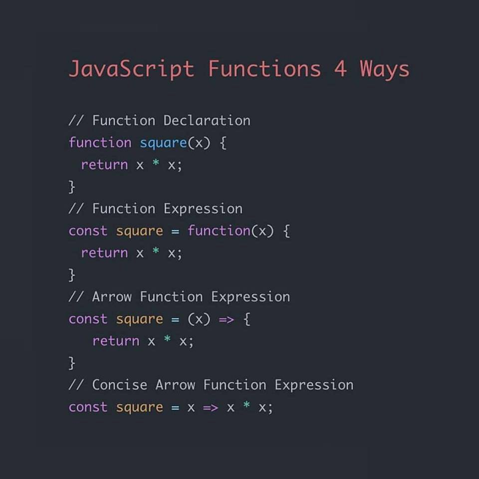

# Lesson 3: Functions

## Contents
1. [Functions](#1-functions)

-----
## 1. Functions
- How to declare a function
```javascript
     /**
      * Code 1: Declaration function (1)
      */  
     function printHelloWorld() {
          console.log("Hello World!");
     }
     // Call functions
     printHelloWorld();

     /**
      * Code 2: Expression function (2)
      */
     var helloWorld = function() {
          console.log("Hello World");
     }
     // Call functions
     helloWorld();

     /**
      * Code 3: Arrow function (3)
      */ 
     const helloWorld = () => { 
          console.log("Hello World");
     }
     // Call functions
     helloWorld();
```

- Know more about `var`, `let` and `const` - click [here](./../material/VarLetConst.md)



- How to pass the value of parameter in the function
```javascript
     /**
      * Code 4: Pass the value of parameter in the function by agruments
      */
     function writeLog() {
          console.log(arguments);
     }
     // Call functions
     writeLog(1, 2, 3);

     OR:

     function writeLog() {
          for (var temp of arguments) {
               console.log(temp); 
          }
     }
     // Call functions
     writeLog(1, 2, 3);

     /**
      * Code 5: Pass the value of parameter declared in the function
      */
     const full_name = (name) => {
          console.log("My name is %s", name);
          console.log(`My name is ${name}`);
     }
     // Call functions
     full_name("Gia Phuc");
```
- How to get the return value of the function
```javascript
     /*
      * Code 6: Return the value in the function
      */ 
     let sum = (a, b) => {
          return a + b;
     }
     console.log(sum(1,2));

     OR:

     function sum(a, b) {
          return a + b;
     }
     console.log(sum(1,2));
```
- If the function doesn't have the keyword `return`, it will return `undefined` value
```javascript
     let sum(a, b) {
          return undefined;
     }
     sum (1, 2);
```

2. More about functions

-  When many functions with same name are declared in the code:
```javascript
     function showMsg() {
          console.log("Line 1");
     }

     function showMsg() {
          console.log("Line 2");
     }

     function showMsg() {
          console.log("Line 3");
     }

     showMsg(); // Output: "Line 3"
```

- Private property in functions:
```javascript
     function showMsg(message) {
          var text = "Hello World";
          console.log(message);
     }
     console.log(message); // Can not access
     console.log(text); // Can not access
```

- Nested functions: Function in function
- Remeber that the parameter `message` of function `showMsg2` is different from the parameter `message` of function `showMsg1`.
```javascript
     function showMsg1(message) {
          function showMsg2(message) {
               console.log(message);
          }
          showMsg2(message)
     }
     showMsg1("Hello World");
```