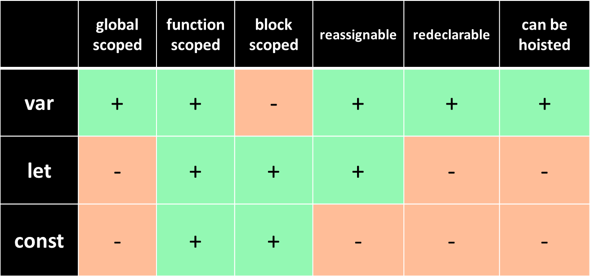

# Var - Let - Const 

## 1. Introduction
- `ES6` (short for ECMAScript 6) is a set of advanced JavaScript techniques. ECMAScript was proposed by the European Computer Manufacturers Association as the standard of the Javascript language. You would think that nowadays there are quite a few Browsers, and if each browser has a different way of running Javascript, websites cannot work on all browsers, so there needs to be a standard. generic to force browsers to develop against that standard.
- One of the standout features of ES6 is the addition of permission and const for data variable declarations. So why do we need let and const even though we already have var to declare variables, in this article we will learn the reasons for each type of variable declaration.

## 2. Comparison
- `var`:
     - Scope: `var` has function scope. It is visible throughout the entire function in which it is declared, regardless of block scope.
     - Hoisting: Variables declared with `var` are hoisted to the top of their scope. This means that you can use a variable before it is declared, but its value will be `undefined`.
     - Mutability: Variables declared with `var` can be reassigned and redeclared within the same scope.

- `let`:
     - Scope: `let` has block scope. It is visible only within the block in which it is declared, such as within loops or conditional statements.
     - Hoisting: Variables declared with `let` are not hoisted to the top of their scope. They are not accessible before the line of code where they are declared.
     - Mutability: Variables declared with `let` can be reassigned, but they cannot be redeclared within the same scope.

- `const`:
     - Scope: `const` also has block scope like `let`. It is visible only within the block in which it is declared.
     - Hoisting: Variables declared with `const` are not hoisted to the top of their scope. They are not accessible before the line of code where they are declared.
     - Mutability: Variables declared with `const` are read-only and cannot be reassigned or redeclared once they are assigned a value. However, if the variable is an object or an array, its properties or elements can still be modified.

- Picture:

## 3. References

1. Viblo Asia - [Differentiate between var, let, and const variables in JavaScript](https://viblo.asia/p/phan-biet-kieu-bien-var-let-va-const-trong-javascript-ORNZqaOnZ0n)
2. Free Code Camp - [var, let, and const in JavaScript – the Differences Between These Keywords Explained](https://www.freecodecamp.org/news/differences-between-var-let-const-javascript/)